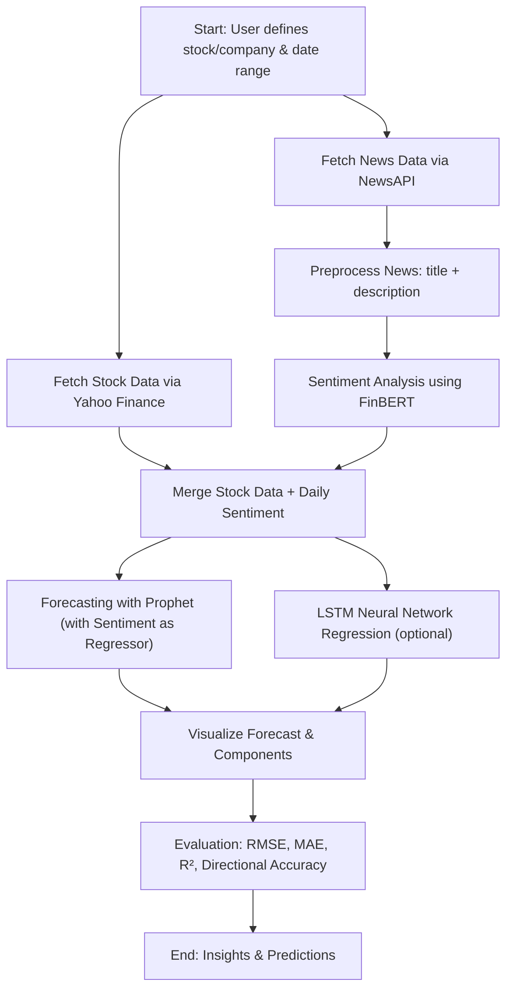

# News → Market / Signal Forecasting Prototype

Combines **Natural Language Processing (NLP)** with **Time Series Forecasting** to predict future stock trends using news sentiment.  
Author: **Kevin Edward Dean**

---

## Overview

This project is a **modular pipeline** that predicts stock prices by combining:

1. **Stock Market Data** – Daily stock prices via Yahoo Finance (`yfinance`).
2. **News Sentiment Analysis** – NLP-based sentiment scores using **FinBERT**.
3. **Time Series Forecasting** – Prophet model incorporating daily sentiment as an external regressor.
4. **Neural Network Regression (Optional)** – LSTM model for sequential price prediction.

The pipeline can be run end-to-end or modularly for **data fetching, sentiment analysis, forecasting, and evaluation**.

---


---

## Flow Diagram



---

## Key Components

1. **Dataset Class**
- Fetches daily stock prices via yfinance.
- Fetches company news via NewsAPI.
- Handles missing or empty news gracefully.
- Returns a unified DataFrame with `date` and `text`.

2. **Sentiment Analysis**
- Uses FinBERT `(yiyanghkust/finbert-tone)` for financial sentiment.
- Converts news text into a sentiment score: `[-1, 0, 1]`.
- Aggregates sentiment per day.

3. **MergeData Class**
- Merges stock and sentiment data on the `date` column.
- Produces final DataFrame (`ds`, `y`, `sentiment`) ready for modeling.

4. **RegressionModelProphet**
- Prophet time series model with `sentiment` as an external regressor.
- Provides:
  - Forecast plotting
  - Component visualization (trend, seasonality)
  - RMSE evaluation

5. **NeuralNetworkRegression**
- LSTM-based model to predict future prices using sequences of `y` + `sentiment`.
- Scales features via `MinMaxScaler`.
- Evaluates:
  - RMSE, MAE, R²
  - Directional Accuracy (up/down movement)
- Plots predictions vs actual prices.

---

## Installation

```bash
# Clone the repository
git clone https://github.com/yourusername/market-signal-forecasting.git
cd market-signal-forecasting
```

---

## Configuration

You can adjust the values in the main script and others to your settings:
1. Stock symbol/company
```bash
STOCK_SYMBOL = "AAPL"
COMPANY_NAME = "Apple"
```

2. Date Range
```bash
START_DATE = "2024-01-01"
END_DATE = datetime.today().strftime("%Y-%m-%d")
```

3. News API Key
```
NEWS_API_KEY = "your_news_api_key"
```

- if no key is provided, the pipeline will not run.


---

## Running the Pipeline
```bash
# Run the main modular pipeline
python src/main.py
```

Outputs:
- Prophet forecast plots
- Forecast component plots
- LSTM predictions (if enabled)
- Evaluation metrics:
  - RMSE, MAE, R²
  - Directional accuracy
 
---

## Notes / Tips
- API Limits: Free NewsAPI keys only allow past ~1 month. To backfill older news, either use your own archive or skip sentiment.
- Performance: LSTM training can be slow; reduce `epochs` or sequence `window` for faster prototyping.
- Extensibility: The modular design allows swapping NLP models or adding extra regressors.

---

This README:

1. Explains the **overall project goal** and modules.
2. Gives a **flow diagram** (Mermaid) showing dependencies.
3. Explains **how to run** the pipeline and configure the API key.
4. Notes differences in API handling, backfill limits, and performance tips.

---
