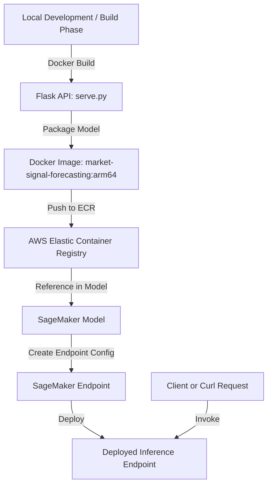

# 🧠 Market Signal Forecasting — End-to-End Deployment Guide

## Overview
This repository demonstrates how to containerize and deploy a machine learning model for real-time inference using AWS SageMaker.

The deployment process includes building a TensorFlow-based model inside a custom Docker container, testing it locally on macOS ARM (M1/M2), and deploying it to a SageMaker-managed endpoint for production inference.

---

## 🧩 Project Architecture

| Component |	Description |
|-----------|-------------|
| Model	| TensorFlow model packaged for market signal forecasting |
| Serving Framework	| Flask-based REST API `(serve.py)` |
| Container Platform |	Docker (multi-architecture: ARM64 for macOS + AWS Graviton) |
| Cloud Service	| AWS SageMaker for managed endpoint hosting |
| Registry | Amazon Elastic Container Registry (ECR) |


---

## 🧩 Architecture Diagram (Mermaid)



---

## ⚙️ Step-by-Step Setup

1. **Build Docker Image (ARM64)**
Since macOS M1/M2 is ARM-based, we needed to ensure compatibility by building for `linux/arm64`.
```bash
docker buildx build --platform linux/arm64 -t market-signal-forecasting:arm64 .
```

---

2. **Test Locally**
Run the container with Flask exposed on port `8080`:
```bash
docker run --platform linux/arm64 -p 8080:8080 market-signal-forecasting:arm64
```

Then send a test request:
```bash
curl -X POST http://localhost:8080/invocations \
-H "Content-Type: application/json" \
-d '{"company": "Apple", "symbol": "AAPL"}'
```

✅ **Expected result**: JSON response with prediction output.

---

3. **Push Image to Amazon ECR**

Authenticate and push the image:
```bash
aws ecr get-login-password --region us-east-2 \
| docker login --username AWS --password-stdin <your-account-id>.dkr.ecr.us-east-2.amazonaws.com

docker tag market-signal-forecasting:arm64 \
<your-account-id>.dkr.ecr.us-east-2.amazonaws.com/market-signal-forecasting:arm64

docker push <your-account-id>.dkr.ecr.us-east-2.amazonaws.com/market-signal-forecasting:arm64
```

---

4. **Create Sagemaker Model**
```bash
aws sagemaker create-model \
  --model-name market-signal-forecasting-arm64 \
  --primary-container Image=<your-account-id>.dkr.ecr.us-east-2.amazonaws.com/market-signal-forecasting:arm64 \
  --execution-role-arn arn:aws:iam::<your-account-id>:role/sagemake-role-market-signal-forecasting \
  --region us-east-2
```

---

5. **Deploy Endpoint**
```bash
aws sagemaker create-endpoint-config \
  --endpoint-config-name market-signal-forecasting-config \
  --production-variants VariantName=AllTraffic,ModelName=market-signal-forecasting-arm64,InitialInstanceCount=1,InstanceType=ml.m6g.large

aws sagemaker create-endpoint \
  --endpoint-name market-signal-forecasting-endpoint \
  --endpoint-config-name market-signal-forecasting-config
```

---

6. **Invoke Endpoint**

Once the endpoint status is `InService`:
```bash
aws sagemaker-runtime invoke-endpoint \
    --endpoint-name market-signal-forecasting-endpoint-arm64 \
    --content-type application/json \
    --body '{"company": "Apple", "symbol": "AAPL"}' \
    --cli-binary-format raw-in-base64-out \
    --region us-east-2 \
    output.json

# View Output
cat output.json
```

✅ Result: Returns a valid prediction response from the hosted model.

---

## 🧩 Common Issues & Solutions

| Problem | Root Cause | Solution |
|----------|-------------|----------|
| **OCI runtime create failed: exec: "serve": executable file not found** | CMD wasn’t pointing to Python interpreter correctly | Changed `CMD ["python", "serve.py"]` in Dockerfile |
| **curl: (7) Failed to connect to localhost:8080** | Container wasn’t publishing the internal port | Added `-p 8080:8080` when testing locally |
| **SageMaker deployment fails on x86 instance** | Image built for ARM (`linux/arm64`) | Used `ml.m6g.large` (Graviton ARM instance) |
| **TensorFlow errors on macOS** | Incompatibility between TensorFlow-CPU and Apple Silicon | Installed via `tensorflow==2.16.1` with correct platform tag |
| **Container won’t start on SageMaker** | Entrypoint mismatch | Verified Flask server starts on `0.0.0.0:8080` inside container |

---

## 🔍 Validation
- ✅ Works locally via Docker ARM64 build
- ✅ Deploys successfully on AWS SageMaker ARM instance (`ml.m6g.large`)
- ✅ Accepts POST requests through `/invocations`
- ✅ Produces correct inference results
